## Automatic fault interpretation with optimal surface voting

This repository contains computer programs written and used by 
[Xinming Wu](http://www.jsg.utexas.edu/wu/) 
for 2D and 3D horizon extraction that is discussed in our Geophysics paper 
[Automatic fault interpretation with optimal surface voting](http://www.jsg.utexas.edu/wu/files/wu2018automaticFaultInterpretationWithOptimalSurfaceVotingLow.pdf).

If you find this work helpful in your research, please cite:

    @article{wu2018least,
        author = {Xinming Wu and Sergey Fomel},
        title = {Automatic fault interpretation with optimal surface voting},
        journal = {GEOPHYSICS},
        volume = {83},
        number = {5},
        pages = {O67-O82},
        year = {2018},
        doi = {10.1190/GEO2018-0115.1},
        URL = {https://library.seg.org/doi/abs/10.1190/geo2018-0115.1},
    }

### The source codes will be coming soon. As people are asking for the test datasets in this paper, we decide to first share the datasets here before the source codes.

---
## Examples

2D and 3D examples published in the [paper](http://www.jsg.utexas.edu/wu/files/wu2018automaticFaultInterpretationWithOptimalSurfaceVotingLow.pdf).

### 2D examples

#### 1) Campos data in Figure 9 (seismic data was provided by Dr. Michael Hudec)
Dimensions: n1=300, n2=550

Data type:  binary with BIG_ENDIAN

Seismic: ./data/2d/campos/gx373.dat

OSV fault: ./data/2d/campos/fv.dat

Thinned OSV fault: ./data/2d/campos/fvt.dat

  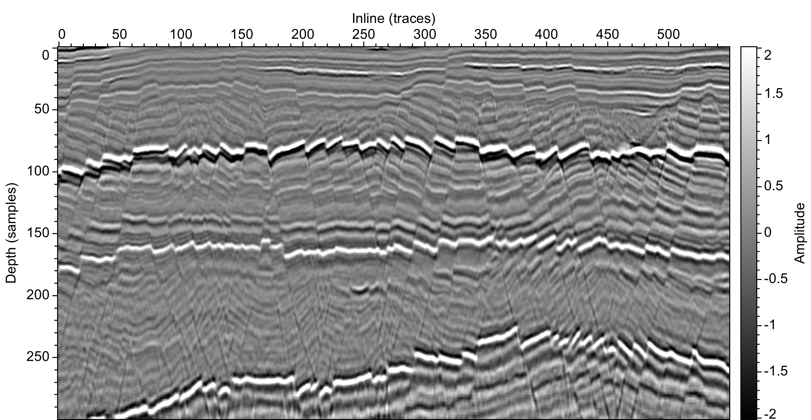
  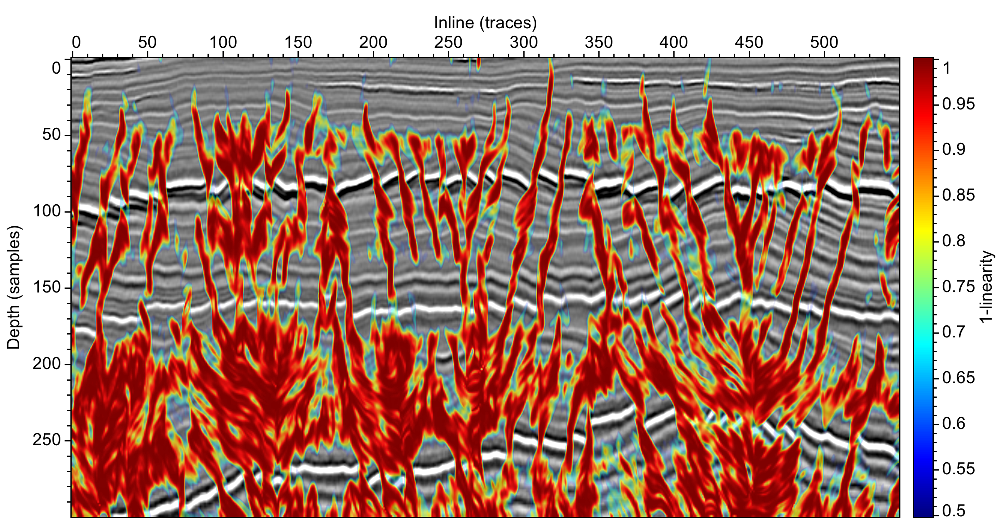

  
  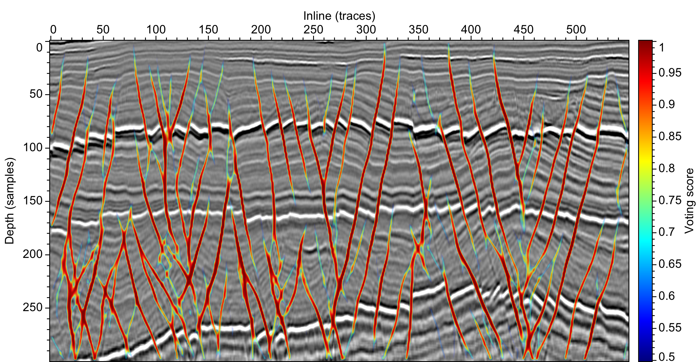

#### 2) Costa Rica data in Figure 10 (acquired in the subduction zone, Costa Rica Margin, provided by Nathan Bangs)

Dimensions: n1=210, n2=825

Data type:  binary with BIG_ENDIAN

Seismic: ./data/2d/crf/gx3366.dat

OSV fault: ./data/2d/crf/fv.dat

Thinned OSV fault: ./data/2d/crf/fvt.dat

Fault likelihood: ./data/2d/crf/fl.dat

Thinned fault likelihood: ./data/2d/crf/flt.dat

  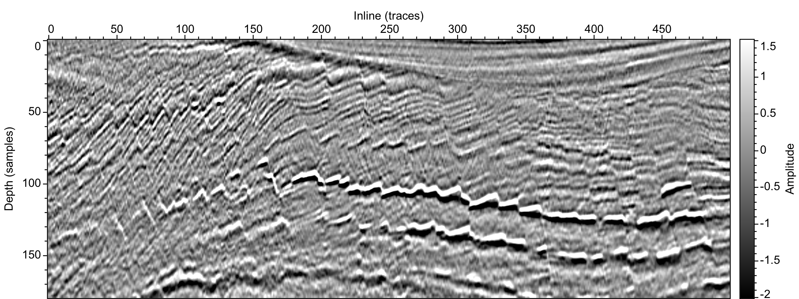
  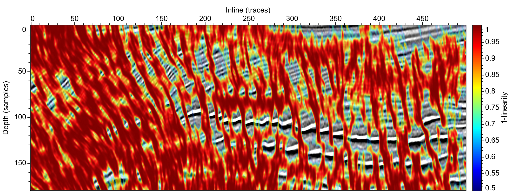

  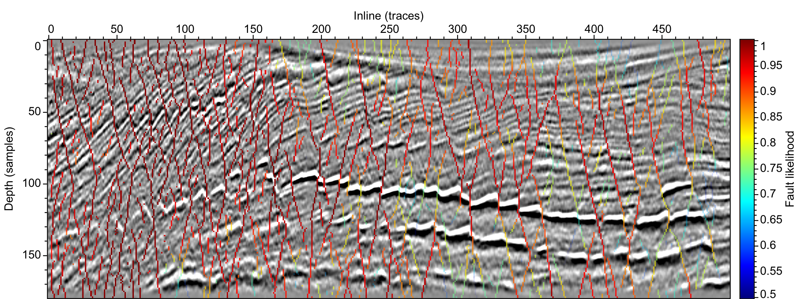
  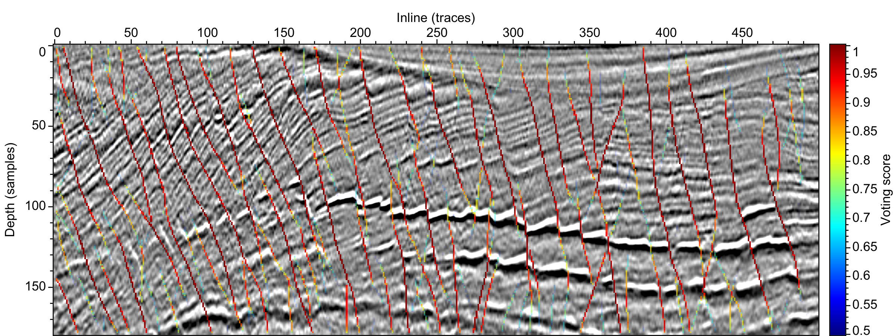

---
### 3D examples

#### 1) F3 data in Figure 11 (provided by the Dutch Government through TNO and dGB Earth Sciences)
Dimensions: n1=100, n2=400, n3=420

Data type:  binary with BIG_ENDIAN

Seismic: ./data/3d/f3d/xs.dat

Input planarity: ./data/3d/f3d/ep.dat

OSV fault: ./data/3d/f3d/fvt.dat

Fault likelihood: ./data/3d/f3d/fl.dat

  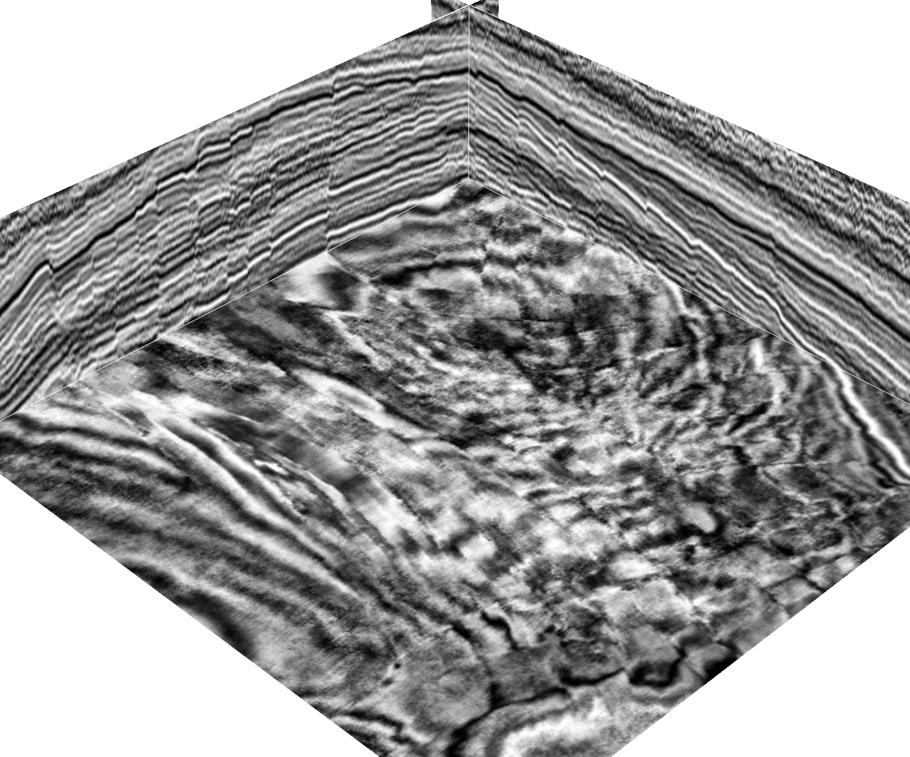
  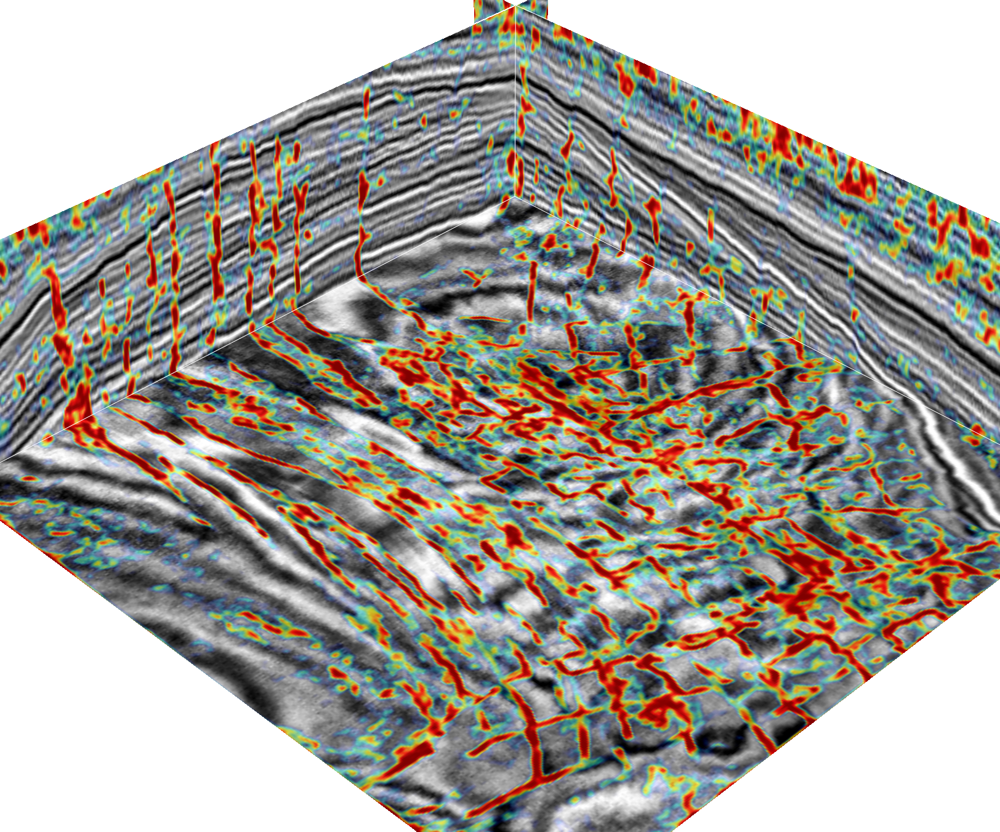

  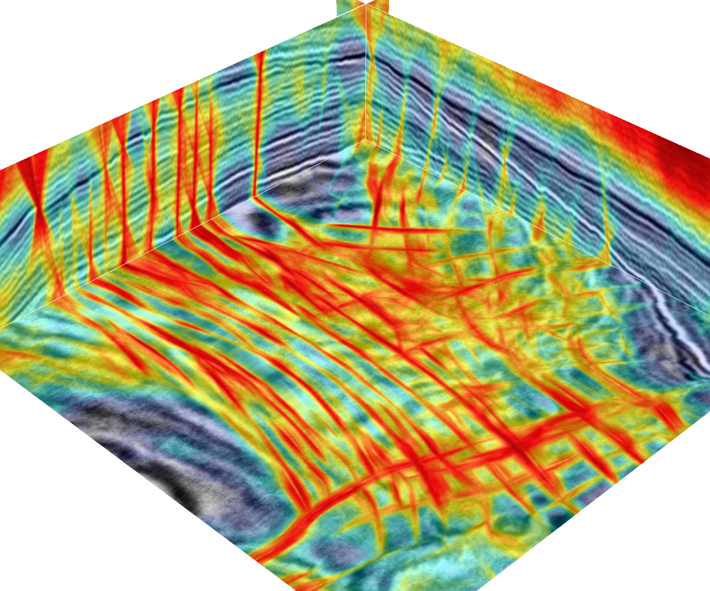
  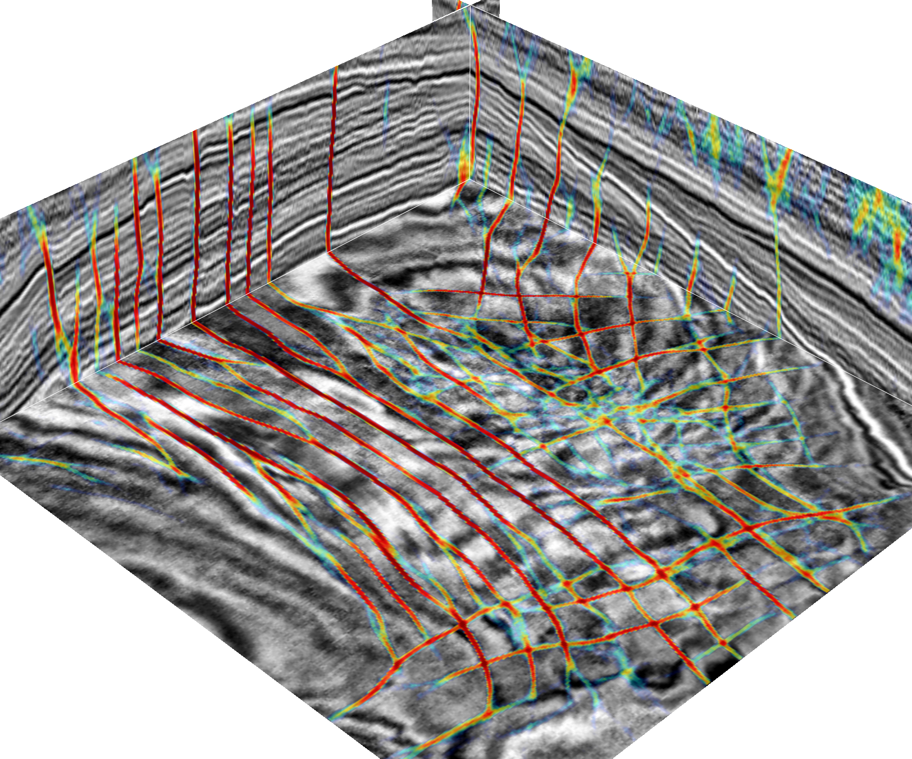

#### 2) Clyde data in Figures 14 and 15 (provided by Clyde through Paradigm)
Dimensions: n1=400, n2=801, n3=300

#### 2) provided by RCRL at BEG (purchased from Australian Government-Geoscience Australia)
A horizon surface extracted using the proposed method with one control point (green point in (b))

  

---
Copyright (c) 2018, Xinming Wu. All rights reserved.
This software and accompanying materials are made available under the terms of
the [Common Public License - v1.0](http://www.eclipse.org/legal/cpl-v10.html),
which accompanies this distribution.
