## Automatic fault interpretation with optimal surface voting

###This work will be presented at the 2018 SEG annual meeting:

###Presentation Date and Time: October 17, 2018 from 8:30 AM to 8:55 AM

###Session Room: 210A (Anaheim Convention Center), in the Anaheim Convention Center

This repository contains computer programs written and used by 
[Xinming Wu](http://www.jsg.utexas.edu/wu/) 
for 2D and 3D fault interpretation that is discussed in our Geophysics paper 
[Automatic fault interpretation with optimal surface voting](http://www.jsg.utexas.edu/wu/files/wu2018automaticFaultInterpretationWithOptimalSurfaceVotingLow.pdf).

If you find this work helpful in your research, please cite:

    @article{wu2018automatic,
        author = {Xinming Wu and Sergey Fomel},
        title = {Automatic fault interpretation with optimal surface voting},
        journal = {GEOPHYSICS},
        volume = {83},
        number = {5},
        pages = {O67-O82},
        year = {2018},
        doi = {10.1190/GEO2018-0115.1},
        URL = {https://library.seg.org/doi/abs/10.1190/geo2018-0115.1},
    }

### Summary

If you want to do more than browse the source code, you must first download 
and build the package using [Gradle](https://gradle.org/).

Here are brief descriptions of key components:

#### OptimalSurfaceVoter
Computes optimal voting surfaces, voting scores and a final 3D voting score map.

#### OptimalSurfaceVoter
Computes optimal voting paths, voting scores and a final 2D voting score map.

#### FaultOrientScanner2
Quickly scan for approximate fault dips

#### FaultOrientScanner3
Quickly scan for approximate fault strikes and dips

#### FaultSkinner
Automatically construct fault skins/surfaces from a final voting score map

#### FaultSkin
A simple linked data structure to represent a fault surface as discussed 
by [Wu and Hale (2016)](http://www.jsg.utexas.edu/wu/files/wu2016SeismicImageProcessingForFaults.pdf)

### Run a demo
1) download the [3D seismic data "xs.dat"](https://drive.google.com/open?id=1InfMvCSZWdJclykiTBIXDgV7HYdBj5_K) into the folder ./data/3d/f3d/

2) go to ./src/osv/ and type ./jy demoF3d.py to run a test on the F3 dataset

---
## Examples

2D and 3D examples published in the [paper](http://www.jsg.utexas.edu/wu/files/wu2018automaticFaultInterpretationWithOptimalSurfaceVotingLow.pdf).

### 2D examples

#### 1) F3 data in Figures 7 and 8 (provided by the Dutch Government through TNO and dGB Earth Sciences)

Dimensions: n1=380, n2=591

Data type:  binary with BIG_ENDIAN

Seismic: ./data/2d/f3d/gx56.dat

Linearity: ./data/2d/f3d/ep56.dat

OSV fault: ./data/2d/f3d/fv.dat

Thinned OSV fault: ./data/2d/f3d/fvt.dat

  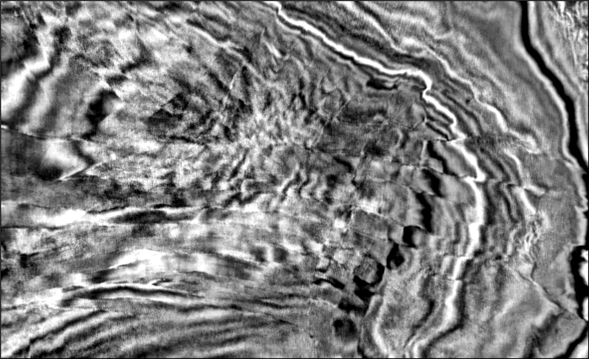
  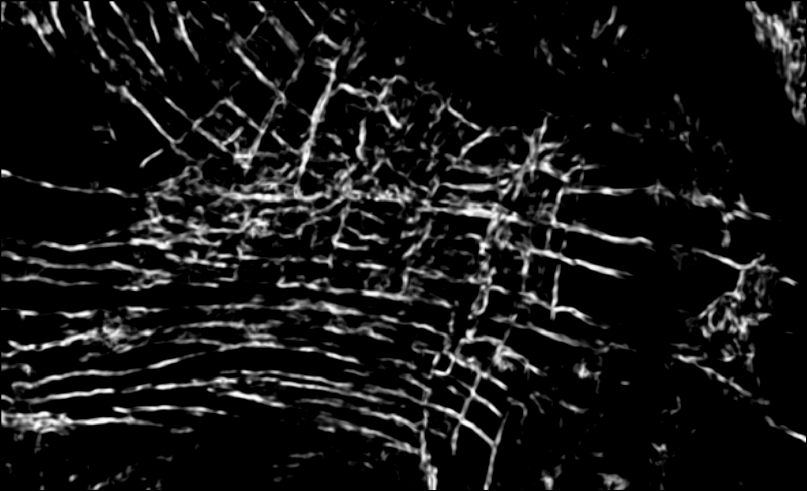

  seismic time/depth slice (left) and 1-planarity (input for optimal path voting)

  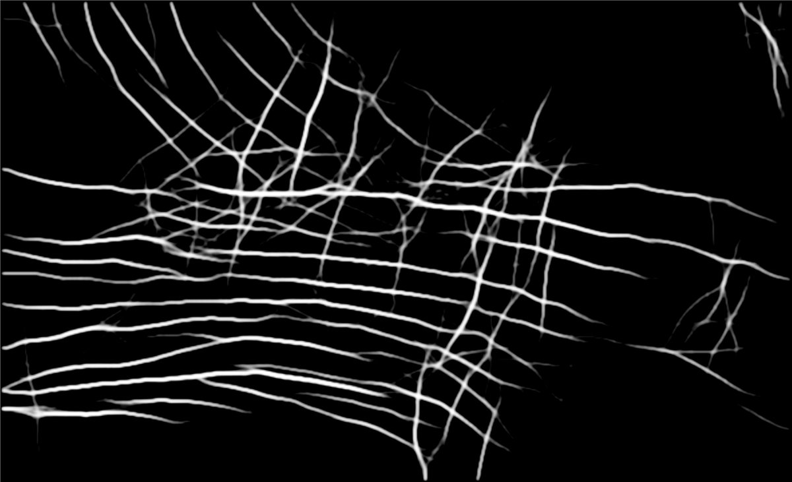
  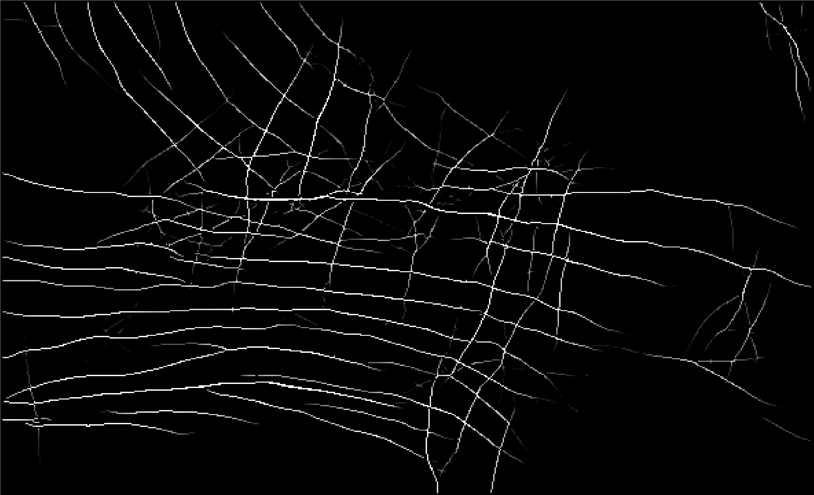

  optimal path voting faults before (left) and after (right) thinning

#### 2) Campos data in Figure 9 (seismic data was provided by [Dr. Michael Hudec](http://www.beg.utexas.edu/people/michael-hudec))
Dimensions: n1=300, n2=550

Data type:  binary with BIG_ENDIAN

Seismic: ./data/2d/campos/gx373.dat

OSV fault: ./data/2d/campos/fv.dat

Thinned OSV fault: ./data/2d/campos/fvt.dat

  
  

   ---------------------seismic image (left) and fault likelihood ([Hale, 2013](https://library.seg.org/doi/10.1190/geo2012-0331.1); [Wu and Hale, 2016](https://library.seg.org/doi/10.1190/geo2015-0380.1))-----------------------

  
  

  input 1-linearity (left) and output optimal path voting faults (right)

#### 3) Costa Rica data in Figure 10 (acquired in the subduction zone, Costa Rica Margin, provided by [Dr. Nathan Bangs](https://ig.utexas.edu/staff/nathan-bangs/))

Dimensions: n1=210, n2=825

Data type:  binary with BIG_ENDIAN

Seismic: ./data/2d/crf/gx3366.dat

OSV fault: ./data/2d/crf/fv.dat

Thinned OSV fault: ./data/2d/crf/fvt.dat

Fault likelihood: ./data/2d/crf/fl.dat

Thinned fault likelihood: ./data/2d/crf/flt.dat

  
  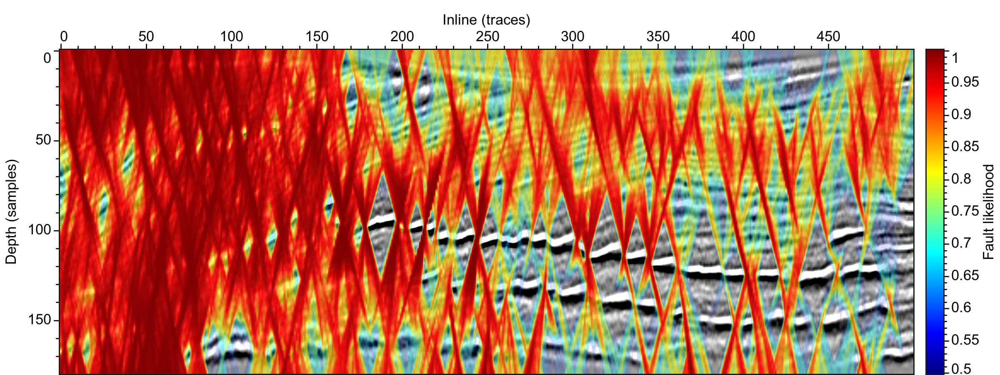

   ---------------------seismic image (left) and fault likelihood ([Hale, 2013](https://library.seg.org/doi/10.1190/geo2012-0331.1); [Wu and Hale, 2016](https://library.seg.org/doi/10.1190/geo2015-0380.1))-----------------------

  
  

  input 1-linearity (left) and output optimal path voting faults (right)

---
### 3D examples

#### 1) F3 data in Figure 11 (provided by the Dutch Government through TNO and dGB Earth Sciences)
The datasets can be downloaded from: https://drive.google.com/open?id=1InfMvCSZWdJclykiTBIXDgV7HYdBj5_K

Dimensions: n1=100, n2=400, n3=420;

Data type:binary with BIG_ENDIAN

Seismic: xs.dat;   

Input planarity: ep.dat

Output OSV fault: fv.dat

Thinned OSV fault: fvt.dat

Fault likelihood: fl.dat

  
  

   ---------------------seismic image (left) and fault likelihood ([Hale, 2013](https://library.seg.org/doi/10.1190/geo2012-0331.1); [Wu and Hale, 2016](https://library.seg.org/doi/10.1190/geo2015-0380.1))-----------------------

  
  

  input 1-planarity (left) and output optimal surface voting (OSV) fault (right)

  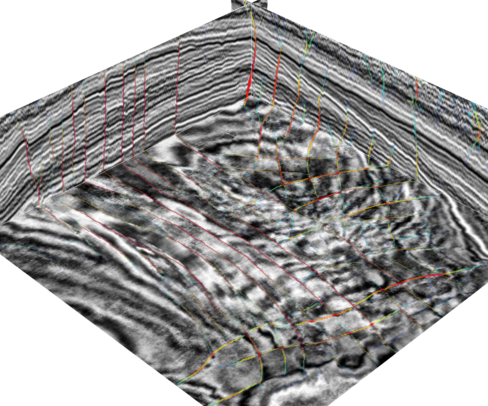
  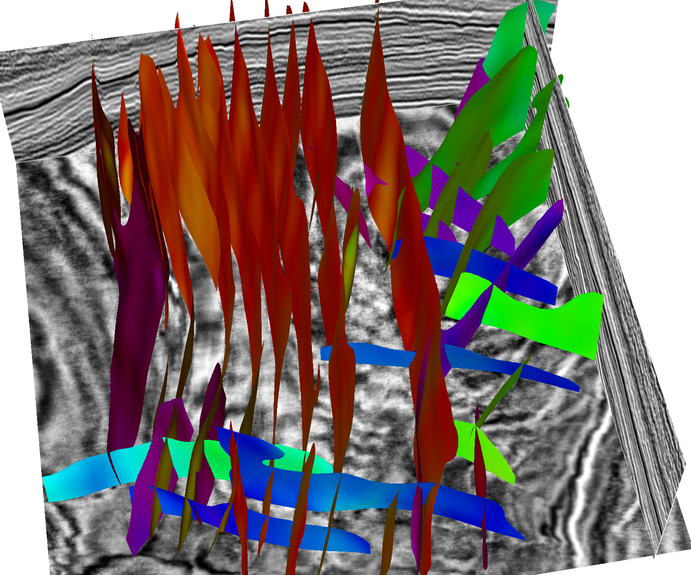

  thinned OSV fault (left) and automatic fault surfaces colored by fault strike (right)

#### 2) Clyde data in Figures 14 and 15 (provided by Clyde through Paradigm)
The datasets can be downloaded from:
https://drive.google.com/open?id=10x1uO-GBJekmD2wS7S6VFbVsrxGXzMCC

Dimensions: n1=400, n2=801, n3=300

Data type:binary with BIG_ENDIAN

Seismic: gx.dat

OSV fault: fv.dat

  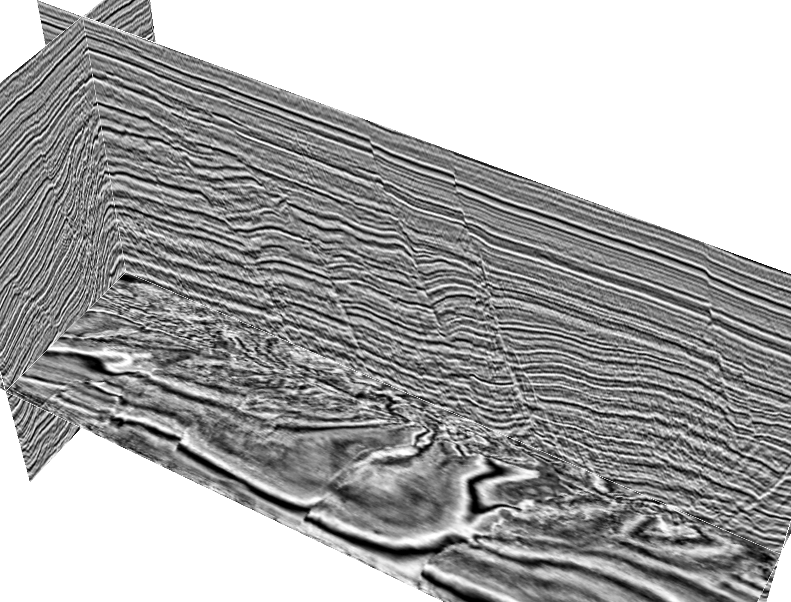
  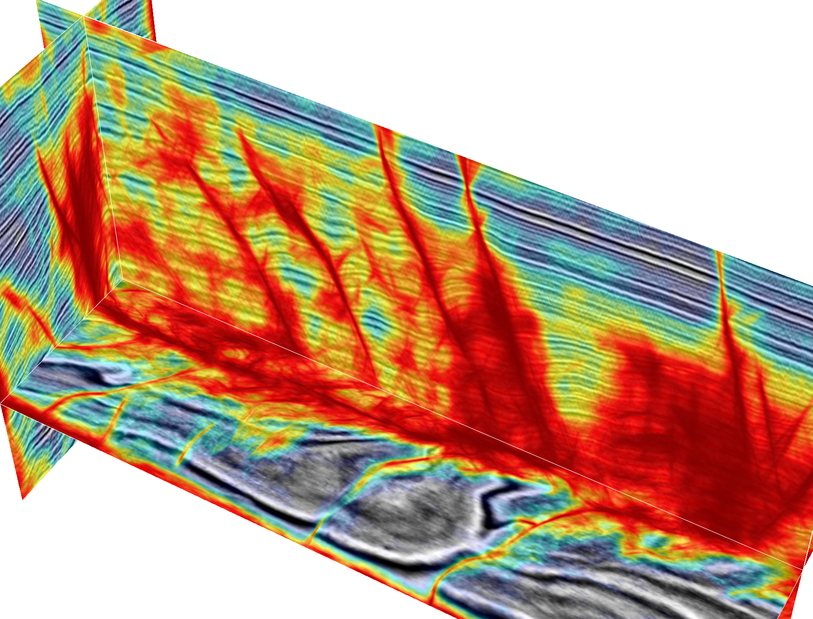

   ---------------------seismic image (left) and fault likelihood ([Hale, 2013](https://library.seg.org/doi/10.1190/geo2012-0331.1); [Wu and Hale, 2016](https://library.seg.org/doi/10.1190/geo2015-0380.1))-----------------------

  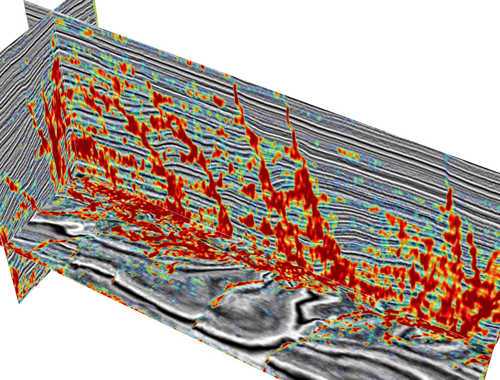
  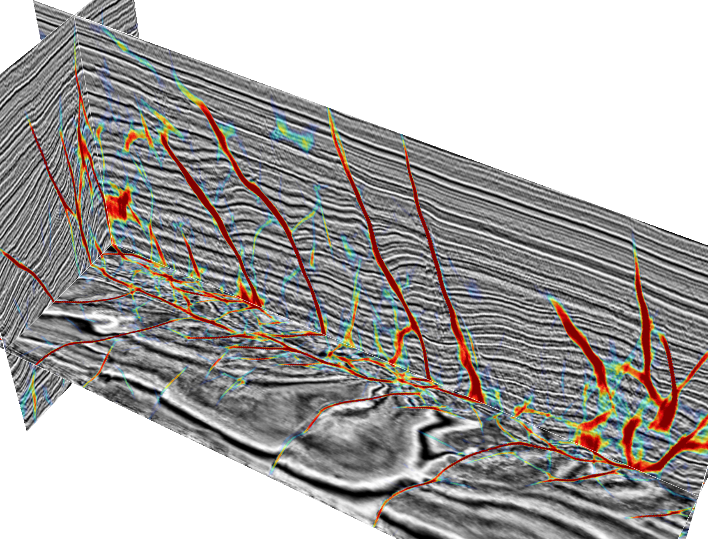

  input 1-planarity (left) and output OSV fault (right)

  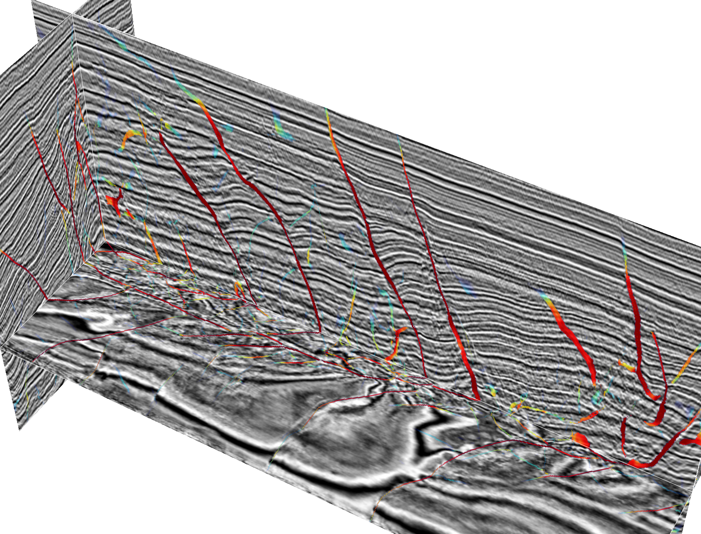
  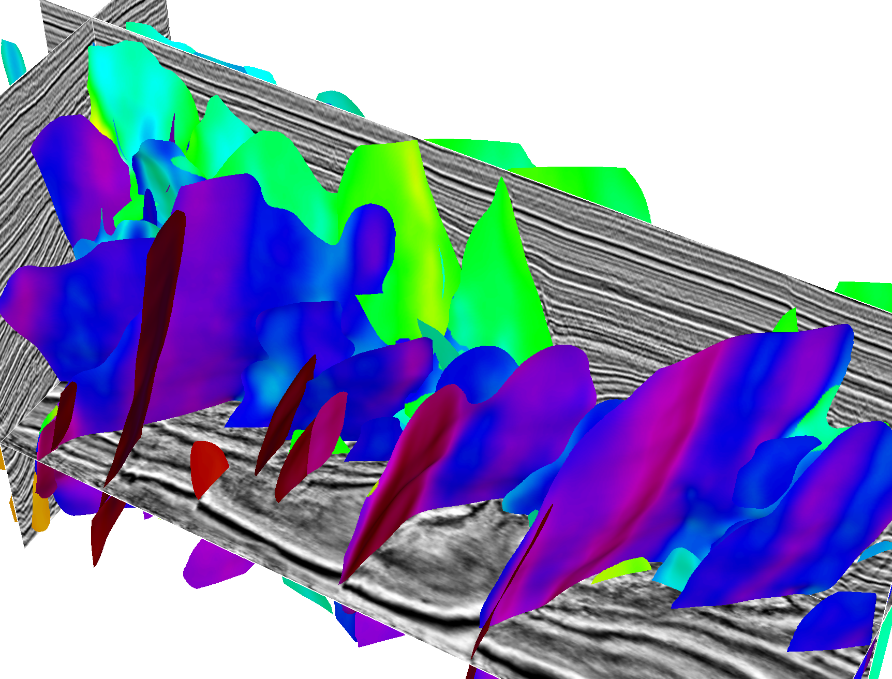

  thinned OSV fault (left) and automatic fault surfaces colored by fault strike (right)

#### 3) Costa Rica data in Figure 16 (acquired in the subduction zone, Costa Rica Margin, provided by Nathan Bangs)
The datasets can be downloaded from: https://drive.google.com/open?id=1fjZuonXYc55ytiKiFboUVkQWVRbht0yQ

Dimensions: n1=210, n2=920, n3=825;

Data type:binary with BIG_ENDIAN

Seismic: gx.dat;   

OSV fault: fv.dat; 

Thinned OSV fault: fvt.dat; 

  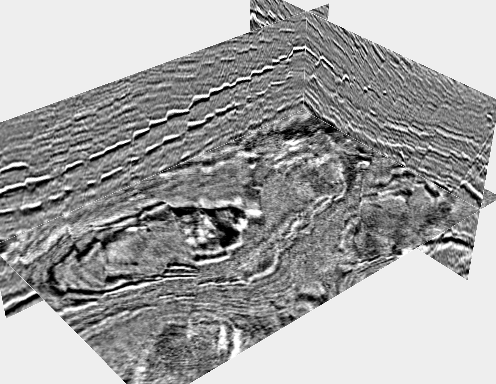
  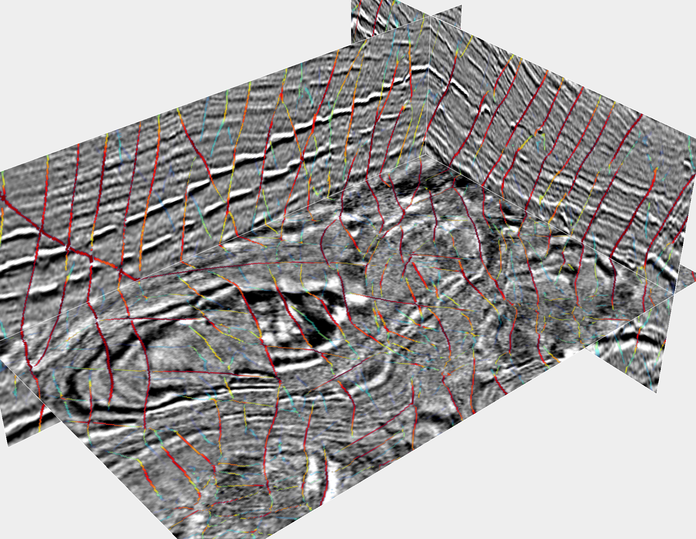

  seismic image (left) and thinned OSV fault (right)

  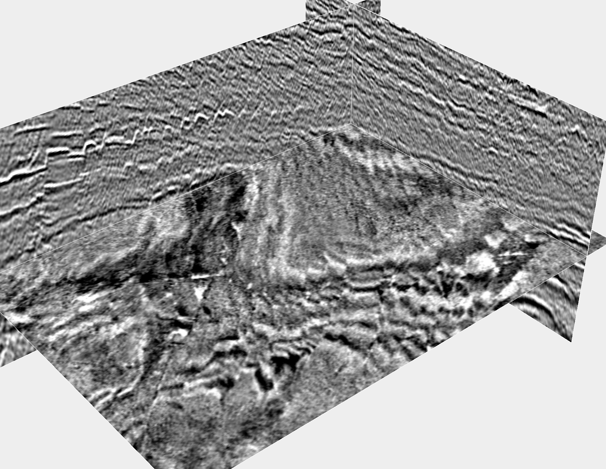
  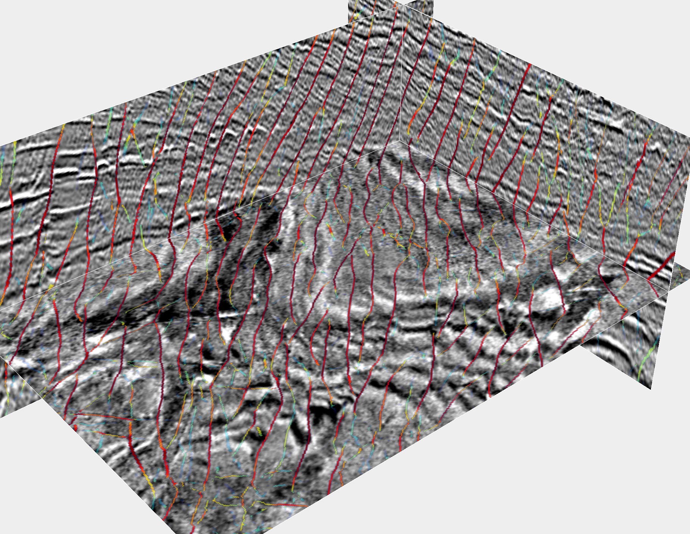

  seismic image (left) and thinned OSV fault (right)

---
Copyright (c) 2018, Xinming Wu. All rights reserved.
This software and accompanying materials are made available under the terms of
the [Common Public License - v1.0](http://www.eclipse.org/legal/cpl-v10.html),
which accompanies this distribution.
